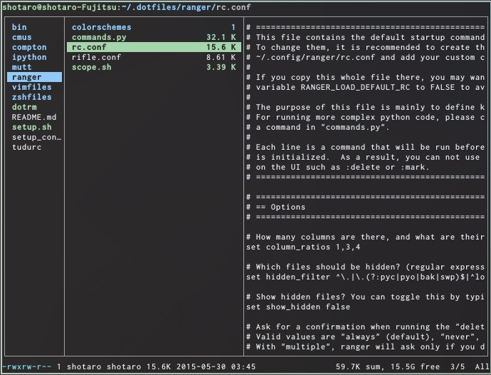
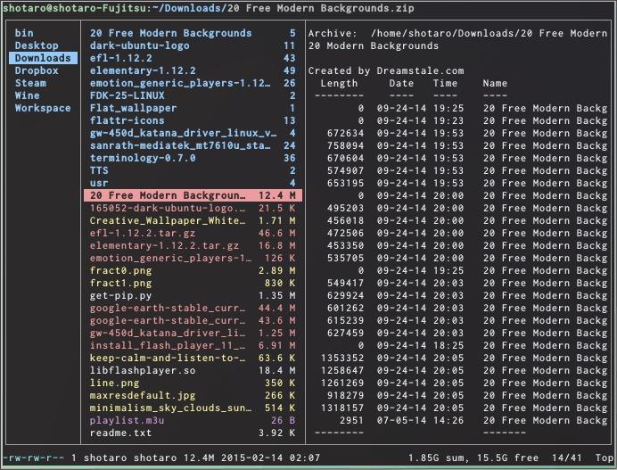
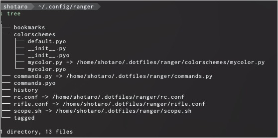
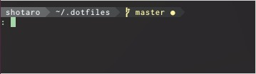
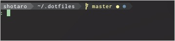

% コマンドラインで動かすファイルマネージャrangerの設定
<div align="right">
<p>2015-05-30</p>
</div>

LinuxもしくはMacで使うことの出来る、CLIファイルマネージャである[ranger](http://ranger.nongnu.org/)の紹介と、使いやすくする設定を紹介します。






まず、rangerそのものについてですが、vimライクなキーアサインでも動かすことができ、設定ファイルも読みやすく、挙動も安定しているので、CLIで動くファイルマネージャを探しているのなら、迷わずこれでいいと思います。なにより軽いので、GUIでファイルマネージャを使うよりは軽快で、一度このスピードになれてしまうと、もう戻れない感覚だと思います。

詳細な説明については、rangerの[Wiki](https://github.com/hut/ranger/wiki)を見てもらうか、英語ですが以下の動画を見てもらえば分かるのではないかと思います。以下では、個人的に便利だと感じた使い方と、設定について述べていこうと思います。

- [Ranger - Console File Manager - Linux TUI - YouTube](https://www.youtube.com/watch?v=qooLR8NmYKs)  
[![ Ranger - Console File Manager - Linux TUI - YouTube [Ranger - Console File Manager - Linux TUI - YouTube]](http://img.youtube.com/vi/qooLR8NmYKs/2.jpg)](https://www.youtube.com/watch?v=qooLR8NmYKs)

- [ranger screenshots](http://ranger.nongnu.org/screenshots.html)


## 基本のキーアサイン

以下に基本的なキーアサインを書いておきます。これだけ押さえていれば、大体普通の作業をするのには困らないと思います。とってもVim的なキーバインドなので、慣れている人であれば、すぐに使えるようになると思います。

+-----------------------+-----------------------------------------------------+
| command               | 操作                                                |
+=======================+=====================================================+
|`h,j,k,l` or 矢印キー  | 上下左右移動                                        |
+-----------------------+-----------------------------------------------------+
|  `r`                  |  起動するアプリケーションを指定                     |
+-----------------------+-----------------------------------------------------+
|  Space                | ファイルを選択                                      |
+-----------------------+-----------------------------------------------------+
|  `v`                  | すべて選択                                          |
+-----------------------+-----------------------------------------------------+
|  `V`                  | 選択モード(範囲選択)                                |
+-----------------------+-----------------------------------------------------+
|  `y<char>`            | yank & 何か操作                                     |
+-----------------------+-----------------------------------------------------+
|  `yy`                 | 選択されているファイルをコピー                      |
+-----------------------+-----------------------------------------------------+
|  `yp`                 | 選択されているファイルのフルパスをコピー(xselが必要)|
+-----------------------+-----------------------------------------------------+
|  `d<char>`            | cut  & 何か操作                                     |
+-----------------------+-----------------------------------------------------+
|  `dd`                 | 選択されたファイルを切り取り                        |
+-----------------------+-----------------------------------------------------+
|  `p<char>`            | 貼り付け + オプション                               |
+-----------------------+-----------------------------------------------------+
|  `pp`                 | 切り取り、コピーしたファイルを貼り付け              |
+-----------------------+-----------------------------------------------------+
|  Delete               | 削除(rm)                                            |
+-----------------------+-----------------------------------------------------+
| `g<char>`             | `<char>`で指定された動きをする                      |
+-----------------------+-----------------------------------------------------+
|  `gn` or Ctrl+`n`     | 新しいタブを開く                                    |
+-----------------------+-----------------------------------------------------+
|   `gc` or  Ctrl+`w`   | タブを閉じる                                        |
+-----------------------+-----------------------------------------------------+
|  `gt` or Ctrl+Tab     | 次のタブへ移動                                      |
+-----------------------+-----------------------------------------------------+
|`gT` or Ctrl+Shift+Tab | 前のタブへ移動                                      |
+-----------------------+-----------------------------------------------------+
| Alt+`<n>`             | 番号`<n>`のタブへ移動                               |
+-----------------------+-----------------------------------------------------+
| `z<char>`             | オプションのトグル                                  |
+-----------------------+-----------------------------------------------------+
| `zh`                  | 隠しファイルの表示/非表示のトグル                   |
+-----------------------+-----------------------------------------------------+
|  `m<char>`            | 現在のディレクトリを`<char>`キーでブックマーク      |
+-----------------------+-----------------------------------------------------+
|  ` `<char>`           | ブックマークされたディレクトリに飛ぶ                |
+-----------------------+-----------------------------------------------------+
|  ` ` ` `              | 最近開いたディレクトリに飛ぶ                        |
+-----------------------+-----------------------------------------------------+
|  `cw`                 | ファイル名を編集                                    |
+-----------------------+-----------------------------------------------------+
|  `A`                  | ファイル名を編集(現在のファイル名が入った状態)      |
+-----------------------+-----------------------------------------------------+
|   `/`                 | インクリメンタルサーチ                              |
+-----------------------+-----------------------------------------------------+
|   `S`                 | 現在のディレクトリでサブシェルに入る                |
+-----------------------+-----------------------------------------------------+
|   `:`                 |コマンド入力モードに入る(Ctrl+`c`で抜ける)           |
+-----------------------+-----------------------------------------------------+
|   `!`                 | 現在のディレクトリでシェルコマンドを実行する        |
+-----------------------+-----------------------------------------------------+
|   `q`                 | rangerを終了                                        |
+-----------------------+-----------------------------------------------------+
| `?`                   |  マニュアルを表示                                   |
+-----------------------+-----------------------------------------------------+
| `1?`                  |  キーバインディングを表示                           |
+-----------------------+-----------------------------------------------------+
| `2?`                  |  コマンドのヘルプを表示                             |
+-----------------------+-----------------------------------------------------+
| `3?`                  |  現在の設定値を表示                                 |
+-----------------------+-----------------------------------------------------+

## 設定ファイル

rangerの設定ファイルは、Linuxなら`~/.config/ranger`以下にあります。



rc.confではオプションとキーバインディングを、rifle.confでは、各ファイルタイプについて、どのプログラムを用いて開くかを設定できます。元々の設定ファイルがよく書かれているので、ある程度英語が読めれば、簡単に設定が出来ると思います。

scope.shでは、

```bash
# ranger supports enhanced previews.  If the option "use_preview_script"
# is set to True and this file exists, this script will be called and its
# output is displayed in ranger.  ANSI color codes are supported.
```

とあるように、オプションでプレビュー表示をオンにしたとき(`set preview_files true`)に、ファイルタイプにあわせてどのようなプログラムを使ってプレビュー表示をさせるかを設定することができます。

また、colorscheme以下に自分で定義したカラースキームを置き、モジュールとして読み込むようにしてあげると、カラースキームを変更することができます。デフォルトでは"default","jungle","snow"が使えます。

自分の設定ファイル晒しときますね。

- [dotfiles/ranger at master · ssh0/dotfiles](https://github.com/ssh0/dotfiles/tree/master/ranger)

## rangerに関連して設定しておくといいもの

rangerを使っていると、cdコマンドを使って移動するより断然早くディレクトリ間を移動できるので、どんどん`S`でシェルで抜けてまたrangerを開いて・・・としていくことになるかと思います。さて、一段落したので端末を閉じましょう、というときに、`exit`とすると、rangerが立ち上がります。！？となるかもしれませんが、`S`はサブシェルを開いてその中で作業するものなので、気がついたらどんどんネストしていた、という自体に簡単に陥ります。これを解決する簡単な方法は、`~/.zshrc`などに、以下のように関数を登録しておくことです。([Start new ranger instance only if it's not running in current shell](https://wiki.archlinux.org/index.php/Ranger#Start_new_ranger_instance_only_if_it.27s_not_running_in_current_shell))

```bash
function r() {
    if [ -z "$RANGER_LEVEL" ]; then
        ranger $@
    else
        exit
    fi
}
```

rangerはサブシェルを立ち上げるときに環境変数`$RANGER_LEVEL`にゼロでない値を入れていくので、これによって既にサブシェルの中にいるときに`r`でranegrを起動しようとしたときには一回そのサブシェルを閉じることでrangerの画面に戻るようにしたものが上のスクリプトの意味するところです。

また、これと全く同じように、自分が今サブシェルにいるかどうかを判定することができるので、promptの情報としてこれを表示させれば便利ですね。以下の情報はかなり偏ったものですので飛ばして頂いても構いません。zsh以外のシェルやテーマを使っている方にとっても参考になればいいんですが。

僕はoh-my-zshのagnosterテーマを改変して使っているので、その中で

```bash
prompt_ranger() {
  if [[ -n ${RANGER_LEVEL} ]]; then
    prompt_segment 236 blue "®"
  fi
}
```

としてプロンプトを表示する部分を定義しておいて、

```bash
## Main prompt
build_prompt() {
  RETVAL=$?
  prompt_status
  prompt_virtualenv
  prompt_context
  prompt_dir
  prompt_git
  prompt_ranger # <<<
  prompt_hg
  prompt_end
}
```

として反映させれば、サブシェル以下にいないときは



のように表示されるのに対し、rangerから`S`で抜けた後は




プロンプトが表示されて、今自分がrangerの作ったサブシェルの中にいることが見て分かるようになります。


## まとめ

以上、簡単ですがCLIファイルマネージャrangerの紹介と、その設定についてまとめました。ターミナル上で動かすことのメリットはたくさんあると思うので、ちょっとした日々の操作にも、ぜひ使ってみるといいと思います。皆さんのコマンドライン生活が豊かになりますように！
